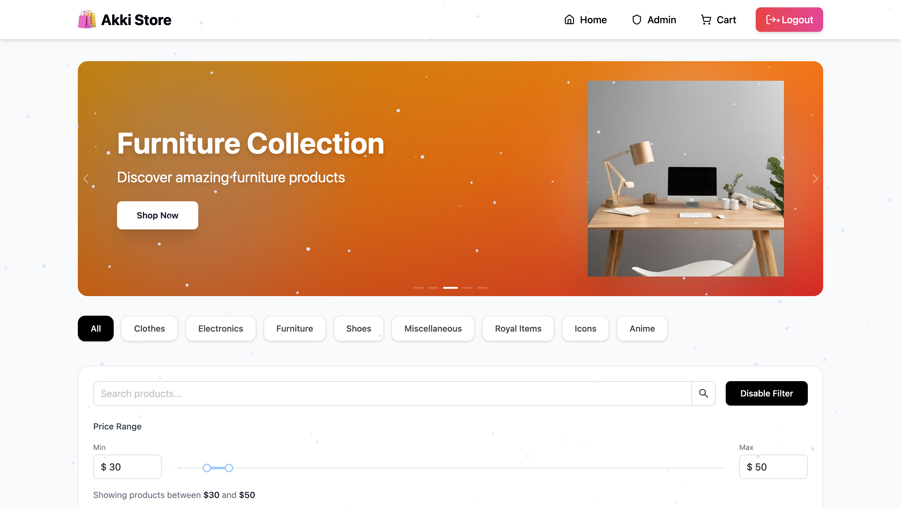
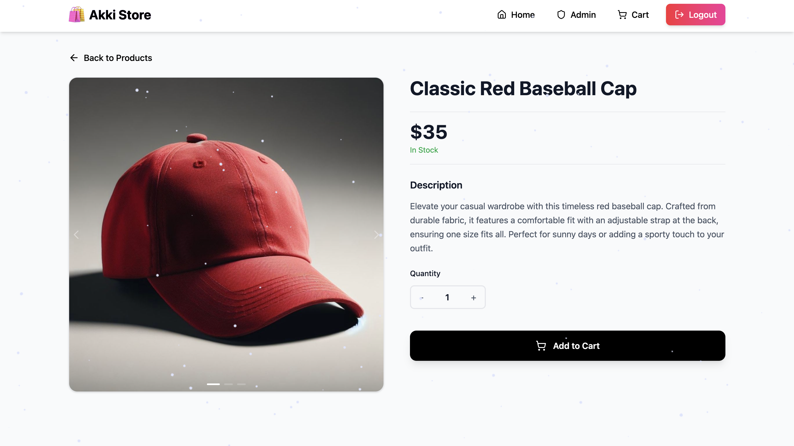
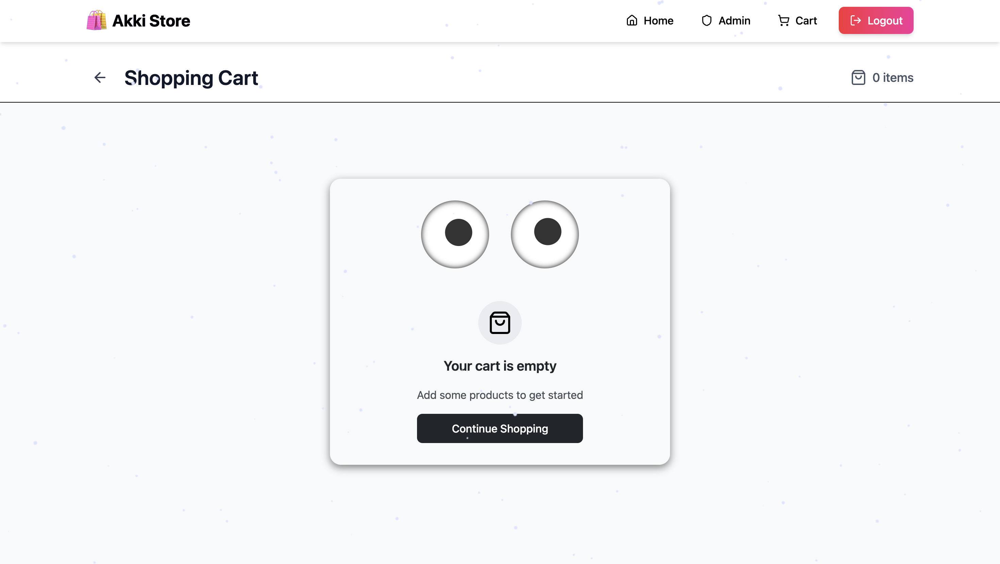
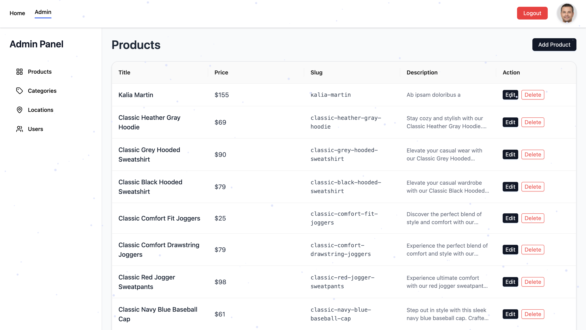
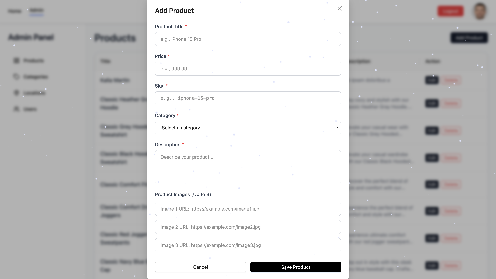

# 🛒 Akmal E-Commerce

Bu loyiha **React, Redux Toolkit va Ant Design** yordamida ishlab chiqilgan **to‘liq funksional E-commerce (onlayn savdo) web ilova** hisoblanadi.  
Loyihada foydalanuvchi tomoni va admin panel to‘liq ishlab chiqilgan.

🌐 Live demo:  
https://akmal-e-commerse.netlify.app

---

## 🛠 Texnologiyalar

- ⚛️ React
- 🧰 Redux Toolkit
- 🔁 RTK Query
- 🎨 Ant Design
- 🌐 REST API
- 📱 Responsive Design

---

## ⚙️ Asosiy imkoniyatlar (Features)

### 🛍 Foydalanuvchi tomoni
- ✅ Mahsulotlarni ko‘rish
- ✅ Kategoriya bo‘yicha filterlash
- ✅ Narx oralig‘i bo‘yicha filterlash
- ✅ Qidiruv (search)
- ✅ Pagination (sahifalash)
- ✅ To‘liq responsive dizayn (mobile / tablet / desktop)

---

## 📸 Screenshots

### 🏠 Home Page


### 🛍 Products Page


### 📄 Product Detail


### 🛒 Cart


### 🛠 Admin Dashboard


### 📦 Admin – Products


### 🛠 Admin Panel


## Admin panel orqali quyidagi obyektlar ustida **CRUD** amallari bajariladi:

- 📦 Mahsulotlar (Products)
- 🗂 Kategoriyalar (Categories)
- 📍 Joylashuvlar (Locations)
- 👤 Foydalanuvchilar (Users)

---

### 🔐 Autentifikatsiya

- Admin autentifikatsiyasi **access token** va **refresh token** orqali amalga oshirilgan
- Xavfsiz API so‘rovlar

---

### 🔄 API bilan ishlash

- Backend API’lardan ma’lumotlarni olish va boshqarish uchun  
  **Redux Toolkit Query (RTK Query)** ishlatilgan
- Cache va loading holatlari avtomatik boshqariladi

---

## 📁 Project Structure

```text
src/
├── components/
├── pages/
├── services/        # RTK Query API'lar
├── store/
├── features/
├── assets/
├── App.jsx / App.tsx
└── main.jsx / main.tsx

